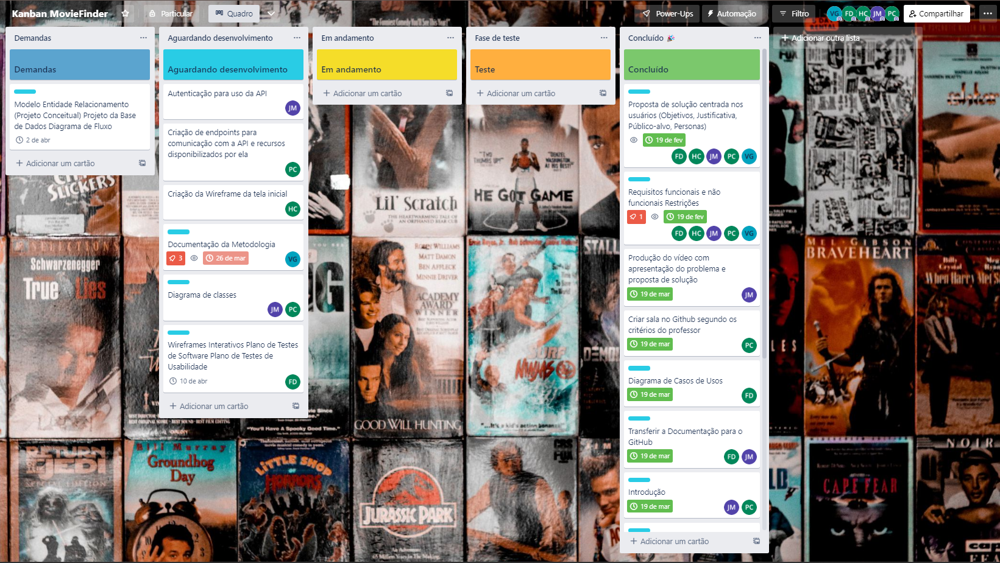

# Metodologia

Esta seção descreve as ferramentas utilizadas pela equipe para a manutenção dos códigos e demais artefatos, para que ocorra maior organização mediante a execução das tarefas do projeto do grupo.

# Gerenciamento de Projeto

Para o desenvolvimento deste projeto, o grupo optou por utilizar o SCRUM como metodologia ágil.

# Divisão de Papéis

 A equipe está organizada da seguinte maneira: 

 Scrum Master: Felipe 

 Product Owner: José Wilson da Costa 

 Equipe de Desenvolvimento: Juliana e Pedro 

 Equipe de Design: Vinicius e Henrique 

# Processo

 Para organização e distribuição das tarefas do projeto, a equipe está utilizando o Trello, estruturado com as seguintes listas: 

 Demandas: recebe as tarefas a serem trabalhadas e representa o Backlog do produto. Todas as atividades identificadas no decorrer do projeto são incorporadas a esta lista. 

 Agaurdando desenvolvimento: esta lista representa o Sprint Backlog que está sendo trabalhado. 

 Em andamento: lista das tarefas iniciadas. 

 Teste: onde a tarefa irá passar por uma vistoria é alguns testes antes de finalizada 

 Concluído: nesta lista são colocadas as tarefas finalizadas e as que passaram pelos testes e controle de qualidade, prontas para serem entregues aos usuários. 

 O quadro kanban do grupo no Trello está disponível no link https://trello.com/b/8tOr5q9j/kanban-moviefinder 

 e é apresentado na figura abaixo 

Figura - Tela do kanban no Trello utilizada pelo grupo

# Ferramentas

As ferramentas do projeto são: 

Editor de código: Visual Studio / Visual Studio Code / Webstorm / Rider 

Ferramenta de gerenciamento: Github / Trello 

Ferramenta de comunicação: Microsoft Teams / Discord 

Ferramenta de desenho de tela (wireframe): Figma 

|AMBIENTE    | PLATAFORMA  | LINK DE ACESSO |
|------|-----------------------------------------|----|
|Repositório de código fonte|<i>GitHub</i>| [MovieFinder GitHub](https://github.com/ICEI-PUC-Minas-PMV-ADS/pmv-ads-2023-1-e2-proj-int-t2-time3-moviefinder) | 
|Kaban|<i>Trello</i>| [Kaban](https://trello.com/b/8tOr5q9j/kanban-moviefinder) |
|Hospedagem Back-end e banco de Dados |<i>Azure</i>| [Back-end Azure](https://projetopucmoviefinder.azurewebsites.net/v1/public)|
|Hospedagem Front-end|<i>Vercel</i>| [Front-end Vercel](https://pmv-ads-2023-1-e2-proj-int-t2-time3-moviefinder.vercel.app/) |
