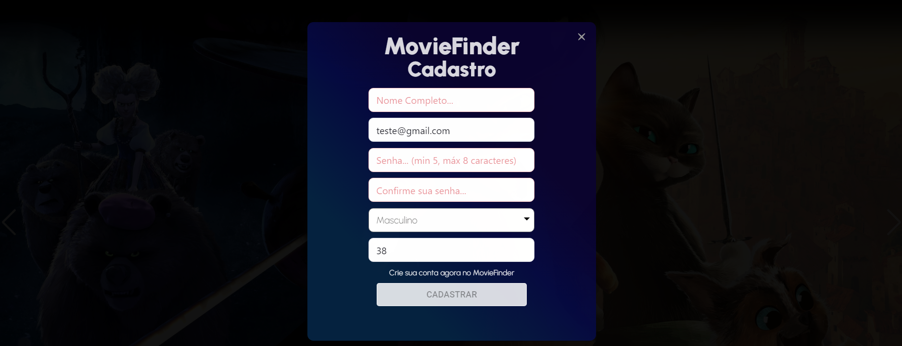

# Programação de Funcionalidades

Nesta seção são apresentadas as funcionalidades do sistema.

## Busca e resultados desejados pelo usuário (RF-01 e RF-02)

Ao acessar o site, no canto superior esquerdo da tela está o botão que encaminha para a área de pesquisa de filmes e relacionados. No modal de pesquisa o usuário digita sua busca e logo abaixo são exibidos os títulos e palavras relacionados ao conteúdo digitado. Em paralelo a isso, são exibidos os pôster dos filmes relacionados à busca. 

### Requisitos atendidos

RF-01 - A aplicação deve permitir que o usuário faça a busca desejada.
RF-02 - A aplicação deve exibir resultados relacionados às palavras buscadas

### Artefatos da funcionalidade

- Busca.jsx
- FilmeController.cs
- TheMovieDataBaseClient.cs

```C#
[HttpGet("movie_query/{query}")]
    public async Task<IActionResult> FindMovieByQuery(string query)
    {
        var response = await _theMovieDataBaseClient.FindMovieByQuery(query, _apiKey, _apiLanguage);
        var movieByQuery = JsonConvert.DeserializeObject<ResultadosFilmePesquisaDto>(response);
        return Ok(movieByQuery);
    }
```

```C#
  public async Task<string> FindMovieByQuery(string query, string apiKey, string apiLanguage)
    {
        return await _httpClient.GetStringAsync(_url + $"/search/movie?api_key={apiKey}&language={apiLanguage}&query={query}&page=1&include_adult=false");
    }
```

```javascript
    const [query, setQuery] = useState('');
    const [movies, setMovies] = useState([]);
```

```javascript
    const handleChange = async (event) => {
    const newInputValue = event.target.value;
    setQuery(newInputValue);
    if (newInputValue === '') {
      setMovies(popularMovies)
      return
    } 
    const response = await findMovie(newInputValue);
    setMovies(response);
  }
```

```javascript
  const findMovie = async (query) => {
    const response = await api.get(`/movieFinder/movie_query/${query}`)
    return response.data.results;
  }
```
```html
     <FormControl id="filter-demo">
            <div className="teste">
              <Autocomplete
                className='teste'
                placeholder="Digite sua busca"
                options={movies}
                getOptionLabel={(option) => option.title || ''}
                filterOptions={filterOptions}
                inputValue={query}
                onInputChange={handleChange}
                style={{margin: "30px"}}
              />
            </div>
          </FormControl>
```

## Plataforma de Streaming e informações sobre o filme (RF-04 e RF-05)

Ao selecionar o filme desejado os detalhes dos filme são exibidos e logo abaixo do pôster do filme é exibida a plataforam de streaming em que o filme encontra-se disponível. Sãpo exibidas as informações de estatísticas sobre as principais críticas, duração total, gênero, liguagem original, sinopse, elenco principal, nome do diretor e outros detalhes.

### Requisitos atendidos

RF-04 - A aplicação deve exibir em qual plataforma de streaming o conteúdo desejado se encontra disponível para exibição. 
RF-05 - A aplicação deve exibir informações como notas dos principais sites agregadores de crítica, duração total, gênero e outras informações relacionadas.

### Artefatos da funcionalidade

- Resultado.jsx
- FilmeController.cs
- TheMovieDataBaseClient.cs

```C#
[HttpGet("movie/top_rated")]
    public async Task<IActionResult> ListTopRatedMovies()
    {
        var response = await _theMovieDataBaseClient.ListTopRatedMovies(_apiKey, _apiLanguage);
        var moviesByTopRated = JsonConvert.DeserializeObject<ListaTopRatedFilmesDto>(response);
        return Ok(moviesByTopRated.Results);
    }
 ```
 
 ```C#
public async Task<string> ListTopRatedMovies(string apiKey, string apiLanguage)
    {
        return await _httpClient.GetStringAsync(_url + $"/movie/top_rated?page=1&api_key={apiKey}&language={apiLanguage}");
    }
 ```  
 
 ```C#
 [HttpGet("movie/{id}")]
    public async Task<IActionResult> FindMovieById(string id)
    {
        var response = await _theMovieDataBaseClient.FindMovieById(id, _apiKey, _apiLanguage);
        var movieById = JsonConvert.DeserializeObject<FilmeDto>(response);
        return Ok(movieById);
    }
 ```

```C#
public async Task<string> FindMovieById(string movieId, string apiKey, string apiLanguage)
    {
        Console.WriteLine(_url + $"/movie/{movieId}?api_key={apiKey}&language={apiLanguage}&append_to_response=credits%2Crecommendations%2Cwatch%2Fproviders");
        return await _httpClient.GetStringAsync(_url + $"/movie/{movieId}?api_key={apiKey}&language={apiLanguage}&append_to_response=credits%2Crecommendations%2Cwatch%2Fproviders");
    }
```

```C#
[HttpGet("person/{id}")]
    public async Task<IActionResult> FindActorById(string id)
    {
        var response = await _theMovieDataBaseClient.FindPersonById(id, _apiKey, _apiLanguage);
        var personById = JsonConvert.DeserializeObject<PessoaDto>(response);
        return Ok(personById);
    }
 ``` 
    
```C#
public async Task<string> FindPersonById(string personId, string apiKey, string apiLanguage)
    {
        return await _httpClient.GetStringAsync(_url + $"/person/{personId}?api_key={apiKey}&language={apiLanguage}&append_to_response=movie_credits");
    }
 ```  
    
```C#
[HttpGet("provider/list")]
    public async Task<IActionResult> ListProviders()
    {
        var response = await _theMovieDataBaseClient.ListProviders(_apiKey, _apiLanguage);
        var providers = JsonConvert.DeserializeObject<ProvedoresDto>(response);
        return Ok(providers);
    }
```

```C#
public async Task<string> ListProviders(string apiKey, string apiLanguage)
    {
        return await _httpClient.GetStringAsync(_url + $"/watch/providers/movie?api_key={apiKey}&language={apiLanguage}&watch_region=BR");
    }
```

```javascript
 const toHoursAndMinutes = () => {
    const totalTimeInMin = movie.runtime
    return Math.floor(totalTimeInMin / 60) + 'h' + totalTimeInMin % 60 + 'm'
  }

  let USDollar = new Intl.NumberFormat('en-US', {
    currency: 'USD',
  });
```

```javascript
const gotoDetails = async (movie) => {
    if (authenticated) {
      await authContext.isFavorite(movie);
    }
    navigate(`/Resultado/${movie.id}`);
  }
```

```javascript
  const getMovie = async () => {
    const response = await api.get(`/movieFinder/movie/${id}`)
    const movie = response.data
    setMovie(movie)
    const genres = movie.genres.map((genre) => genre.id).join()
    if (genres) {
      getDiscoverList(genres)
    }
  }
```

```html
<div className='results-movie-details'>
          <div className='results-movie-details-card'>
            
            <div className='results-movie-details-card-streaming'>
              {movie?.providers?.results?.br?.flatrate !== null && movie?.providers?.results?.br?.flatrate[0].logoPath ?
              
              : <p>?</p> }
              {authenticated && (<div className='results-movie-details-favorite'>
                <h4 className='results-movie-details-favorite-circle' onClick={ starFillCheck }>
                  {starFill || favorito ? <span><MdOutlineFavorite className='results-movie-details-favorite-icon' style={{color: "rgba(255, 0, 0, 0.596"}} /></span> :
                      <span><MdOutlineFavorite className='results-movie-details-favorite-icon' /></span>}
                </h4>
              </div>)}
              <div className='results-movie-details-card-streaming-text'>
                <p>Disponivel em</p>
                <h2>Asista agora</h2>
              </div>
            </div>
          </div>
          <div className='results-movie-details-text' >
            <div className='results-movie-details-title-subdetails'>
              <div className='results-movie-details-title'>
                <h1>{movie.title + "  " }{movie.releaseDate ? (moment(movie.releaseDate).format("YYYY")) : ''}</h1>
              </div>
              <div className='results-movie-details-subdetails'>
                <p>{movie.releaseDate ? moment(movie.releaseDate).format("DD/MM/YYYY") : ''}</p>
                <p>{movie.originalLanguage?.toUpperCase()}</p>
                <span><BsFillCircleFill /></span>
                {movie?.genres?.map((movie) => (
                  <p>{movie.name}</p>
                ))}
                <span><BsFillCircleFill /></span>
                <p>{toHoursAndMinutes()}</p>
              </div>
            </div>
            <div className='results-movie-details-rating-all'>
              <div className='results-movie-details-rating-circle'>
                <ThemeProvider theme={theme}>
                  <Box
                    sx={{
                      position: 'relative',
                      display: 'inline-flex',
                    }}
                  >
                    <div className='results-movie-details-rating'>
                      <CircularProgress
                        value={100}
                        variant="determinate"
                        sx={{
                          position: 'absolute',
                          color: 'rgba(0, 0, 0, 0.432)'
                        }}
                        size={70}
                      />
                      <CircularProgress
                        value={Math.round(movie.voteAverage * 10)}
                        variant="determinate"
                        theme={theme}
                        size={70}
                      />
                      <Box
                        sx={{
                          top: 0,
                          left: 0,
                          bottom: 0,
                          right: 0,
                          position: 'absolute',
                          display: 'flex',
                          alignItems: 'center',
                          justifyContent: 'center',
                        }}
                      >
                        <Typography
                        variant="caption"
                        component="div"
                        color="rgba(255, 255, 255, 0.849)"
                        >
                          {`${Math.round(movie.voteAverage * 10)}%`}
                        </Typography>
                      </Box>
                    </div>
                  </Box>
                </ThemeProvider>
                <div className='results-movie-details-rating-text'>Avaliação <p>feita pelo</p> <p>TMDB</p></div>
              </div>
            </div>
            <div className='results-movie-details-title-subdetails'>
              <h2>Sinopse</h2>
              <p>{movie.overview}</p>
            </div>
            <div className='results-movie-details-title-subdetails'>
              <h2>Nome Diretor</h2>
              {movie?.credits?.crew?.find(crewMember => crewMember.job === "Director") ? (
                  <p>{movie.credits.crew.find(crewMember => crewMember.job === "Director").name}</p>
              ) : (
                  <p>Não há dados sobre o nome do diretor</p>
              )}
            </div>
          </div>
        </div>
      </div>
      <div className='content-body'>
        <div className='content-body-details'>
          <div className='content-body-details-elenco'>
            <h1>Elenco Principal</h1>
          <Swiper
            className='content-body-details-elenco-card'
            style={{
              overflowX: 'auto',
              overflowY: 'auto',
            }}
            breakpoints={{
              "@0.00": {
                slidesPerView: 2,
              },
              "@0.75": {
                slidesPerView: 4,
              },
              "@1.00": {
                slidesPerView: 4,
              },
              "@1.50": {
                slidesPerView: 8,
              },
            }}
            >
            {movie.credits?.cast?.map((actor) =>
            <SwiperSlide>
              <div className='content-body-details-elenco-card-img-name'>
                <div className='content-body-details-elenco-card-img-name-inside'>
                  {actor.profilePath ?
                  
                  : 
                  }
                  <p>{actor.name }</p>
                </div>
              </div>
            </SwiperSlide>
            )}
          </Swiper>
          </div>
          <div className='content-body-details-additional'>
            <div>
              <h2>Orçamento</h2>
              <p>$ {USDollar.format(movie.budget)}</p>
            </div>
            <div>
              <h2>Receita</h2>
              <p>$ {movie.revenue ? USDollar.format(movie.revenue) : ''}</p>
            </div>
            <div>
              <h2>Situação</h2>
              <p>{movie.status}</p>
            </div>
          </div>
        </div>
 ```

## Cadastro de Usuário (RF-07)

O modal de cadastro de usuário apresenta os campos a serem preenchidos. Os campos são: Nome, e-mail, senha, confirme sua senha, selecione o gênero e idade. Não será possível cadastrar mais de um usuário com o mesmo endereço de e-mail. Ao tentar cadastrar um usuário com um endereço de e-mail já existente, um alerta é exibido sinalizando que já há usuário cadastrado com o mesmo e-mail. Todos os campos possuem preenchimento obrigatório, caso algum deles não seja preenchido, seu estilo é alterado e se torna destacado em vermelho. Existem validações específicas, além da verificação de campo vazio, para os campos senha, confirmação de senha e endereço de e-mail. O campo senha permitirá no mínimo 5 caracteres e no máximo 8. O campo de confirmação de senha, consequentemente, também será submetido às mesmas validações além de ter seu conteúdo comparado com o conteúdo inserido no campo "senha". O campo e-mail será validado de acordo com o padrão exigido para um endereço de e-mail válido, como a existência do caracter "@" por exemplo. Ao concluir a ação, ou cancelá-la, fechando o modal, todos os campos são reiniciados.


Na imagem acima é possível observar os campos a serem preenchidos.



Na imagem acima é possível observar o destaque adquirido pelos campos não preenchidos pelo usuário, após a tentativa de cadastro.


Na imagem acima é possível observar a mensagem de sucesso após um cadastro bem sucedido.


Na imagem acima é possível observar os dados do usuário gravados no banco de dados.


Na imagem acima é possível observar a mensagem de erro na tentativa de cadastro de um usuário com um endereço de e-mail já existente no banco de dados.

### Requisitos atendidos

RF-07 - A aplicação deve permitir ao usuário cadastrar, ler, atualizar e excluir suas informações de cadastro.

### Artefatos da funcionalidade

- Home.jsx
- FilmeController.cs
- UsuarioService.cs

```C#
[HttpPost("cadastrarUsuario")]
    public async Task<IActionResult> CadastrarUsuario([FromBody] Usuario usuario)
    {
        var cadastrarUsuario = await _usuarioService.CadastrarUsuario(usuario);
        if (cadastrarUsuario)
        {
            return Ok("Usuario cadastrado com sucesso!");
        }

        return BadRequest("Já existe usuário cadastrado com esse endereço de e-mail!");
    }
```

```C#
public async Task<bool> CadastrarUsuario(Usuario usuario)
    {
        try
        {
            var usuarioDb = await _context.Usuarios.FirstOrDefaultAsync(u => u.Email == usuario.Email);
            if (usuarioDb != null)
            {
                return false;
            }
            _context.Add(usuario);
            await _context.SaveChangesAsync();
            return true;

        }
        catch (Exception e)
        {
            Console.WriteLine($"Ocorreu um erro: {e.Message}");
            throw;
        }
    }
```

```javascript
const [name, setName] = useState('');
  const [isNameValid, setIsNameValid] = useState(true);
  const [email, setEmail] = useState('');
  const [isEmailValid, setIsEmailValid] = useState(true);
  const [password, setPassword] = useState('');
  const [isPasswordValid, setIsPasswordValid] = useState(true);
  const [passwordConfirmation, setPasswordConfirmation] = useState('');
  const [isPasswordConfirmationValid, setIsPasswordConfirmationValid] = useState(true);
  const [age, setAge] = useState('');
  const [isAgeValid, setIsAgeValid] = useState(true);
  const [genre, setGenre] = useState('');
  const [isGenreValid, setIsGenreValid] = useState(true);
  const [open, setOpen] = React.useState(false);
  const [message, setMessage] = useState('');
  const [severity, setSeverity] = useState('');
  ```

```javascript
const showModalRegister = () => { setvisibleRegister(true);}
  const closeModalRegister = () => {
    setvisibleRegister(false);
    setIsNameValid(true);
    setName('');
    setIsEmailValid(true);
    setEmail('');
    setIsPasswordValid(true);
    setPassword('');
    setIsPasswordConfirmationValid(true);
    setPasswordConfirmation('');
    setIsGenreValid(true);
    setGenre('');
    setIsAgeValid(true);
    setAge('');
  }
```

```javascript
const handleSubmit = async () => {
    try {
      if ((isGenreValid && genre !== '') &&
          (isNameValid && name !== '') &&
          (validateEmail(email) && isEmailValid && email !== '') &&
          (isPasswordValid && password !== '' && 5 <= password.length <= 8) &&
          ((isPasswordConfirmationValid && passwordConfirmation !== '') &&
              (passwordConfirmation === password) && passwordConfirmation.length <= 8) &&
          ((isAgeValid && age !== '') && 12 <= age <= 100)) {
        const response = await api.post('/movieFinder/cadastrarUsuario', {
          nome: name,
          email,
          senha: password,
          idade: parseInt(age),
          genero: genre,
        })
        closeModalRegister()
        setSeverity("success");
        setMessage(response.data);
        setOpen(true)
        console.log(response.data);
      } else {
        if (genre === '') {
          setIsGenreValid(false);
        } else {
          setIsGenreValid(true);
        }
        if (name === '') {
          setIsNameValid(false);
        } else {
          setIsNameValid(true);
        }
        if (email === '' || !validateEmail(email)) {
          setIsEmailValid(false);
        } else {
          setIsEmailValid(true);
        }
        if (password === '' || password.length < 5 || password.length > 8) {
          setIsPasswordValid(false);
        } else {
          setIsPasswordValid(true);
        }
        if (passwordConfirmation === '' || passwordConfirmation.length > 8 || passwordConfirmation !== password) {
          setIsPasswordConfirmationValid(false);
        } else {
          setIsPasswordConfirmationValid(true);
        }
        if (age === '' || age < 12 || age > 100) {
          setIsAgeValid(false);
        } else {
          setIsAgeValid(true);
        }
      }

    } catch (error) {
      if (error.response && error.response.data) {
        setSeverity("error");
        setMessage(error.response.data);
        setOpen(true);
        console.error(error.response.data);
      } else {
        console.error(error);
      }
    }
  }
```

```javascript
function validateEmail(email) {
    const regex = /^[^\s@]+@[^\s@]+\.[^\s@]+$/;
    return regex.test(email);
  }
```

```javascript
const handleGenreChange = e => {
    const selectedGenre = e.target.value;
    if (selectedGenre === 'Masculino' || selectedGenre === 'Feminino') {
      setIsGenreValid(true);
      setGenre(selectedGenre);
    } else {
      setIsGenreValid(false);
      setGenre('');
    }
  };
```

```html
<div className="modal-register-home">
                  <h1>MovieFinder</h1>
                  <div className="modal-register-input-button">
                    <div className="modal-register-text">
                      <h2>Cadastro</h2>
                    </div>
                    <Input
                      color={isNameValid ? 'neutral' : 'danger'}
                      disabled={false}
                      size="md"
                      placeholder="Nome Completo..."
                      value={name}
                      onChange={e => setName(e.target.value )}
                    />
                    <Input
                      color={isEmailValid ? 'neutral' : 'danger'}
                      disabled={false}
                      size="md"
                      placeholder="E-mail..."
                      value={email}
                      onChange={e => setEmail(e.target.value )}
                    />
                    <Input
                      color={isPasswordValid ? 'neutral' : 'danger'}
                      disabled={false}
                      placeholder="Senha... (min 5, máx 8 caracteres)"
                      size="md"
                      value={password}
                      onChange={e => setPassword(e.target.value )}
                    />
                    <Input
                      color={isPasswordConfirmationValid ? 'neutral' : 'danger'}
                      disabled={false}
                      placeholder="Confirme sua senha..."
                      size="md"
                      value={passwordConfirmation}
                      onChange={e => setPasswordConfirmation(e.target.value)}
                    />

                    <select                   
                      value={genre}
                      className={`modal-register-select ${isGenreValid ? '' : 'invalid'}`}
                      onChange={handleGenreChange}
                    >
                      <option value="">
                        Selecione o gênero...
                      </option>
                      <option value="Masculino">Masculino</option>
                      <option value="Feminino">Feminino</option>
                    </select>
                    <Input
                      color={isAgeValid ? 'neutral' : 'danger'}
                      type="number"
                      disabled={false}
                      placeholder="Digite sua idade..."
                      size="md"
                      value={age}
                      onChange={e => setAge(e.target.value)}
                    />
                    <p>Crie sua conta agora no MovieFinder</p>
                    <Button
                     className="modal-register-button"
                     onClick={handleSubmit}
                    >
                      Cadastrar
                    </Button>
                  </div>
                </div>
```

```html
<Snackbar anchorOrigin={{ vertical: 'top', horizontal: 'center' }} open={open} autoHideDuration={3000} onClose={handleClose}>
                <Alert elevation={100000000} onClose={handleClose} severity={severity} sx={{ width: '100%' }}>
                  { message }
                </Alert>
              </Snackbar>
```
