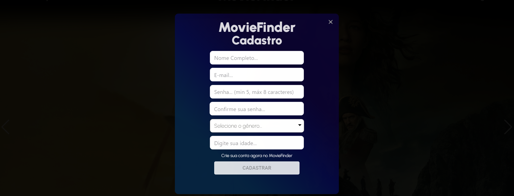

# Programação de Funcionalidades

Nesta seção são apresentadas as funcionalidades do sistema.

## Busca e resultados desejados pelo usuário (RF-01 e RF-02)

Ao acessar o site, no canto superior esquerdo da tela está o botão que encaminha para a área de pesquisa de filmes e relacionados. No modal de pesquisa o usuário digita sua busca e logo abaixo são exibidos os títulos e palavras relacionados ao conteúdo digitado. Em paralelo a isso, são exibidos os pôster dos filmes relacionados à busca. 


Na imagem acima é possível observar os conteúdos relacionados a busca sendo exibidos tanto na barra de pesquisa, quando na exibição dos pôsters.

### Requisitos atendidos

RF-01 - A aplicação deve permitir que o usuário faça a busca desejada.

RF-02 - A aplicação deve exibir resultados relacionados às palavras buscadas

### Artefatos da funcionalidade

- Busca.jsx
- FilmeController.cs
- TheMovieDataBaseClient.cs

```C#
[HttpGet("movie_query/{query}")]
    public async Task<IActionResult> FindMovieByQuery(string query)
    {
        var response = await _theMovieDataBaseClient.FindMovieByQuery(query, _apiKey, _apiLanguage);
        var movieByQuery = JsonConvert.DeserializeObject<ResultadosFilmePesquisaDto>(response);
        return Ok(movieByQuery);
    }
```

```C#
  public async Task<string> FindMovieByQuery(string query, string apiKey, string apiLanguage)
    {
        return await _httpClient.GetStringAsync(_url + $"/search/movie?api_key={apiKey}&language={apiLanguage}&query={query}&page=1&include_adult=false");
    }
```

```javascript
const [query, setQuery] = useState('');
const [movies, setMovies] = useState([]);
```

```javascript
const handleChange = async (event) => {
    const newInputValue = event.target.value;
    setQuery(newInputValue);
    if (newInputValue === '') {
        setMovies(popularMovies)
        return
    }
    const response = await findMovie(newInputValue);
    setMovies(response);
}
```

```javascript
const findMovie = async (query) => {
    const response = await api.get(`/movieFinder/movie_query/${query}`)
    return response.data.results;
}
```
```html
<FormControl id="filter-demo">
    <div className="teste">
        <Autocomplete className='teste' placeholder="Digite sua busca" options={movies} getOptionLabel={(option)=>
            option.title || ''}
            filterOptions={filterOptions}
            inputValue={query}
            onInputChange={handleChange}
            style={{margin: "30px"}}
            />
    </div>
</FormControl>
```
## Aplicação de filtro nas buscas (RF-03)

Ao realizar uma busca, após os resultados serem exibidos, é possível aplicar filtros como gênero e tipo de avaliação.


Na imagem acima é possível observar os conteúdos exibidos somente pelo gênero Animação ao selecionar o filtro deste gênero.


Na imagem acima é possível observar a organização dos filmes do gênero de animação sendo organizados pelos melhores filmes avaliados ao selecionar o filtro de Melhores Avaliados.


Na imagem acima é possível observar o filtro de Melhores Avaliados aplicado em uma busca.

### Requisitos atendidos

RF-03 - A aplicação deve conter filtros para auxiliar na busca do conteúdo pesquisado.

### Artefatos da funcionalidade

- Busca.jsx
- FilmeController.cs
- TheMovieDataBaseClient.cs

```C#
  [HttpGet("discover/movie")]
    public async Task<IActionResult> DiscoverMovies([FromQuery] string genreId)
    {
        var response = await _theMovieDataBaseClient.DiscoverMovies(_apiKey, _apiLanguage, genreId);
        var discover = JsonConvert.DeserializeObject<ListaDiscoverFilmeDto>(response);
        return Ok(discover);
    }

 [HttpGet("movie/popularity")]
    public async Task<IActionResult> ListPopularityMovies()
    {
        var response = await _theMovieDataBaseClient.ListPopularityMovies(_apiKey, _apiLanguage);
        var moviesByPopularity = JsonConvert.DeserializeObject<ListaPopularFilmes>(response);
        return Ok(moviesByPopularity.Results);
    }
    
    [HttpGet("genre/list")]
    public async Task<IActionResult> ListGenres()
    {
        var response = await _theMovieDataBaseClient.ListGenres(_apiKey, _apiLanguage);
        var genres = JsonConvert.DeserializeObject<GenerosDto>(response);
        return Ok(genres);
    }
```

```C#
  public async Task<string> ListGenres(string apiKey, string apiLanguage)
    {
        return await _httpClient.GetStringAsync(_url + $"/genre/movie/list?api_key={apiKey}&language={apiLanguage}");
    }
    
        public async Task<string> ListPopularityMovies(string apiKey, string apiLanguage)
    {
        return await _httpClient.GetStringAsync(_url + $"/movie/popular?page=1&api_key={apiKey}&language={apiLanguage}");
    }
    
      public async Task<string> DiscoverMovies(string apiKey, string apiLanguage, string genreId )
    {
        return await _httpClient.GetStringAsync(_url + $"/discover/movie?api_key={apiKey}&language={apiLanguage}&with_genres={genreId}");
    }
```

```javascript
const getDiscoverList = async (name) => {
    const response = await api.get(`/movieFinder/discover/movie?genreId=${name.id}`)
    setMovies(response.data.results)
}

const orderMoviesByBestVote = () => {
    const orderMovies = [...movies].sort((a, b) => b.voteAverage - a.voteAverage)
    setMovies(orderMovies)
}

const orderMoviesByWorstVote = () => {
    const orderMovies = [...movies].sort((a, b) => a.voteAverage - b.voteAverage)
    setMovies(orderMovies)
}

const filterOptions = createFilterOptions({
    matchFrom: 'start',
    stringify: (option) => option.title,
});

const getPopularMovies = async () => {
    const response = await api.get('/movieFinder/movie/popularity')
    setMovies(response.data)
    setPopularMovies(response.data)
}

const getGenreList = async () => {
    const response = await api.get('/movieFinder/genre/list')
    setGenreList(response.data.genres)
}

useEffect(() => {
    getPopularMovies()
    getGenreList()
}, [])
```

```html
<FormControl id="filter-demo">
    <div className="teste">
        <Autocomplete className='teste' placeholder="Digite sua busca" options={movies} getOptionLabel={(option)=>
            option.title || ''}
            filterOptions={filterOptions}
            inputValue={query}
            onInputChange={handleChange}
            style={{margin: "30px"}}
            clearOnBlur={false}
            />
    </div>
</FormControl>

<h2>Filtros</h2>
<MenuItem onClick={orderReleaseDate}>Lançamentos</MenuItem>
<SubMenu label="Generos">
    {genreList.map((name) => (
    <MenuItem onClick={()=> getDiscoverList(name)}>
    <p>
        {name.name}
    </p>
    </MenuItem>
    ))}
</SubMenu>
<SubMenu label="Por nota">
    <MenuItem onClick={orderMoviesByBestVote}> Melhores avaliados </MenuItem>
    <MenuItem onClick={orderMoviesByWorstVote}> Piores avaliados </MenuItem>
</SubMenu>
```

## Plataforma de Streaming e informações sobre o filme (RF-04 e RF-05)

Ao selecionar o filme desejado os detalhes dos filme são exibidos e logo abaixo do pôster do filme é exibida a plataforam de streaming em que o filme encontra-se disponível. São exibidas as informações de estatísticas sobre as principais críticas, duração total, gênero, liguagem original, sinopse, elenco principal, nome do diretor e outros detalhes.


Na imagem acima é possível observar a exibição das informações do filme e a plataforma de streaming em que o filme encontra-se disponível.

### Requisitos atendidos

RF-04 - A aplicação deve exibir em qual plataforma de streaming o conteúdo desejado se encontra disponível para exibição. 
RF-05 - A aplicação deve exibir informações como notas dos principais sites agregadores de crítica, duração total, gênero e outras informações relacionadas.

### Artefatos da funcionalidade

- Resultado.jsx
- FilmeController.cs
- TheMovieDataBaseClient.cs

```C#
[HttpGet("movie/top_rated")]
    public async Task<IActionResult> ListTopRatedMovies()
    {
        var response = await _theMovieDataBaseClient.ListTopRatedMovies(_apiKey, _apiLanguage);
        var moviesByTopRated = JsonConvert.DeserializeObject<ListaTopRatedFilmesDto>(response);
        return Ok(moviesByTopRated.Results);
    }
 ```
 
 ```C#
public async Task<string> ListTopRatedMovies(string apiKey, string apiLanguage)
    {
        return await _httpClient.GetStringAsync(_url + $"/movie/top_rated?page=1&api_key={apiKey}&language={apiLanguage}");
    }
 ```  
 
 ```C#
 [HttpGet("movie/{id}")]
    public async Task<IActionResult> FindMovieById(string id)
    {
        var response = await _theMovieDataBaseClient.FindMovieById(id, _apiKey, _apiLanguage);
        var movieById = JsonConvert.DeserializeObject<FilmeDto>(response);
        return Ok(movieById);
    }
 ```

```C#
public async Task<string> FindMovieById(string movieId, string apiKey, string apiLanguage)
    {
        Console.WriteLine(_url + $"/movie/{movieId}?api_key={apiKey}&language={apiLanguage}&append_to_response=credits%2Crecommendations%2Cwatch%2Fproviders");
        return await _httpClient.GetStringAsync(_url + $"/movie/{movieId}?api_key={apiKey}&language={apiLanguage}&append_to_response=credits%2Crecommendations%2Cwatch%2Fproviders");
    }
```

```C#
[HttpGet("person/{id}")]
    public async Task<IActionResult> FindActorById(string id)
    {
        var response = await _theMovieDataBaseClient.FindPersonById(id, _apiKey, _apiLanguage);
        var personById = JsonConvert.DeserializeObject<PessoaDto>(response);
        return Ok(personById);
    }
 ``` 
    
```C#
public async Task<string> FindPersonById(string personId, string apiKey, string apiLanguage)
    {
        return await _httpClient.GetStringAsync(_url + $"/person/{personId}?api_key={apiKey}&language={apiLanguage}&append_to_response=movie_credits");
    }
 ```  
    
```C#
[HttpGet("provider/list")]
    public async Task<IActionResult> ListProviders()
    {
        var response = await _theMovieDataBaseClient.ListProviders(_apiKey, _apiLanguage);
        var providers = JsonConvert.DeserializeObject<ProvedoresDto>(response);
        return Ok(providers);
    }
```

```C#
public async Task<string> ListProviders(string apiKey, string apiLanguage)
    {
        return await _httpClient.GetStringAsync(_url + $"/watch/providers/movie?api_key={apiKey}&language={apiLanguage}&watch_region=BR");
    }
```

```javascript
const [popularMovies, setPopularMovies] = useState([]);
const [genreList, setGenreList] = useState([])
```

```javascript
const toHoursAndMinutes = () => {
    const totalTimeInMin = movie.runtime
    return Math.floor(totalTimeInMin / 60) + 'h' + totalTimeInMin % 60 + 'm'
}

let USDollar = new Intl.NumberFormat('en-US', {
    currency: 'USD',
});
```

```javascript
const gotoDetails = async (movie) => {
    if (authenticated) {
        await authContext.isFavorite(movie);
    }
    navigate(`/Resultado/${movie.id}`);
}
```

```javascript
const getMovie = async () => {
    const response = await api.get(`/movieFinder/movie/${id}`)
    const movie = response.data
    setMovie(movie)
    const genres = movie.genres.map((genre) => genre.id).join()
    if (genres) {
        getDiscoverList(genres)
    }
}
```

```html
<div className='results-movie-details'>
    <div className='results-movie-details-card'>
        
        <div className='results-movie-details-card-streaming'>
            {movie?.providers?.results?.br?.flatrate !== null && movie?.providers?.results?.br?.flatrate[0].logoPath ?
            
            : <p>?</p> }
            {authenticated && (<div className='results-movie-details-favorite'>
                <h4 className='results-movie-details-favorite-circle' onClick={ starFillCheck }>
                    {starFill || favorito ? <span>
                        <MdOutlineFavorite className='results-movie-details-favorite-icon'
                            style={{color: "rgba(255, 0, 0, 0.596" }} />
                    </span> :
                    <span>
                        <MdOutlineFavorite className='results-movie-details-favorite-icon' />
                    </span>}
                </h4>
            </div>)}
            <div className='results-movie-details-card-streaming-text'>
                <p>Disponivel em</p>
                <h2>Asista agora</h2>
            </div>
        </div>
    </div>
    <div className='results-movie-details-text'>
        <div className='results-movie-details-title-subdetails'>
            <div className='results-movie-details-title'>
                <h1>{movie.title + " " }{movie.releaseDate ? (moment(movie.releaseDate).format("YYYY")) : ''}</h1>
            </div>
            <div className='results-movie-details-subdetails'>
                <p>{movie.releaseDate ? moment(movie.releaseDate).format("DD/MM/YYYY") : ''}</p>
                <p>{movie.originalLanguage?.toUpperCase()}</p>
                <span>
                    <BsFillCircleFill />
                </span>
                {movie?.genres?.map((movie) => (
                <p>{movie.name}</p>
                ))}
                <span>
                    <BsFillCircleFill />
                </span>
                <p>{toHoursAndMinutes()}</p>
            </div>
        </div>
        <div className='results-movie-details-rating-all'>
            <div className='results-movie-details-rating-circle'>
                <ThemeProvider theme={theme}>
                    <Box sx={{ position: 'relative' , display: 'inline-flex' , }}>
                        <div className='results-movie-details-rating'>
                            <CircularProgress value={100} variant="determinate" sx={{ position: 'absolute' ,
                                color: 'rgba(0, 0, 0, 0.432)' }} size={70} />
                            <CircularProgress value={Math.round(movie.voteAverage * 10)} variant="determinate"
                                theme={theme} size={70} />
                            <Box sx={{ top: 0, left: 0, bottom: 0, right: 0, position: 'absolute' , display: 'flex' ,
                                alignItems: 'center' , justifyContent: 'center' , }}>
                                <Typography variant="caption" component="div" color="rgba(255, 255, 255, 0.849)">
                                    {`${Math.round(movie.voteAverage * 10)}%`}
                                </Typography>
                            </Box>
                        </div>
                    </Box>
                </ThemeProvider>
                <div className='results-movie-details-rating-text'>Avaliação <p>feita pelo</p>
                    <p>TMDB</p>
                </div>
            </div>
        </div>
        <div className='results-movie-details-title-subdetails'>
            <h2>Sinopse</h2>
            <p>{movie.overview}</p>
        </div>
        <div className='results-movie-details-title-subdetails'>
            <h2>Nome Diretor</h2>
            {movie?.credits?.crew?.find(crewMember => crewMember.job === "Director") ? (
            <p>{movie.credits.crew.find(crewMember => crewMember.job === "Director").name}</p>
            ) : (
            <p>Não há dados sobre o nome do diretor</p>
            )}
        </div>
    </div>
</div>
</div>
<div className='content-body'>
    <div className='content-body-details'>
        <div className='content-body-details-elenco'>
            <h1>Elenco Principal</h1>
            <Swiper className='content-body-details-elenco-card' style={{ overflowX: 'auto' , overflowY: 'auto' , }}
                breakpoints={{ "@0.00" : { slidesPerView: 2, }, "@0.75" : { slidesPerView: 4, }, "@1.00" : {
                slidesPerView: 4, }, "@1.50" : { slidesPerView: 8, }, }}>
                {movie.credits?.cast?.map((actor) =>
                <SwiperSlide>
                    <div className='content-body-details-elenco-card-img-name'>
                        <div className='content-body-details-elenco-card-img-name-inside'>
                            {actor.profilePath ?
                            
                            : 
                            }
                            <p>{actor.name }</p>
                        </div>
                    </div>
                </SwiperSlide>
                )}
            </Swiper>
        </div>
        <div className='content-body-details-additional'>
            <div>
                <h2>Orçamento</h2>
                <p>$ {USDollar.format(movie.budget)}</p>
            </div>
            <div>
                <h2>Receita</h2>
                <p>$ {movie.revenue ? USDollar.format(movie.revenue) : ''}</p>
            </div>
            <div>
                <h2>Situação</h2>
                <p>{movie.status}</p>
            </div>
        </div>
    </div>
 ```
 
## Favoritos do usuário e conteúdos relacionados (RF-06)

O usuário logado pode favoritar filmes ao longo de todo o site por meio do icone de favorito representado por um coração logo a abaixo do pôster da foto. Ao favoritar um filme, a informação é armazena no banco de dados e na aba "Meus Favoritos" o usuário pode visualizar os filmes favoritados por ele. Logo a abaixo na aba "Recomendados para você" o usuário pode visualizar os filmes recomendados baseado em seus favoritos.


Na imagem acima é possível observar o ícone de favorito em vermelho, indicando que o filme foi favoritado.


Registro dos filmes favoritados pelo usuário no banco de dados


Filmes favoritados pelo usuário.


Filmes recomendados baseados nos favoritos do usuário.

### Requisitos atendidos
RF-06 - A aplicação deve sugerir conteúdos relacionados às buscas já realizadas anteriormente e favoritar conteúdos.	
 
 ### Artefatos da funcionalidade
- Busca.jsx
- Resultado.jsx
- AuthContext.jsx
- FilmeController.cs
- FilmeService.cs
- UsuarioService.cs

```C#
[HttpGet("favoritarFilme/{movieId}")]
    public async Task<IActionResult> FavoritarFilme([FromHeader(Name = "Authorization")] string authorizationHeader,
        string movieId)
    {
        if (authorizationHeader.StartsWith("Bearer "))
        {
            var token = authorizationHeader.Substring("Bearer ".Length);
            var tokenHandler = new JwtSecurityTokenHandler();
            var jwtToken = tokenHandler.ReadJwtToken(token);

            var userId = jwtToken.Claims.FirstOrDefault(c => c.Type.Equals("userId")).Value;

            if (!string.IsNullOrEmpty(userId))
            {
                var movieById = await _theMovieDataBaseClient.FindMovieById(movieId, _apiKey, _apiLanguage);
                var filmeDto = JsonConvert.DeserializeObject<FilmeDto>(movieById);
                var filmeFavoritado = await _filmeService.FavoritarFilme(userId, filmeDto);

                if (filmeFavoritado)
                {
                    return Ok(filmeFavoritado);
                }
                else
                {
                    var responseErro = new
                    {
                        Message = "Filme já favoritado!",
                        Data = filmeDto.Title
                    };

                    return BadRequest(responseErro);
                }
            }
        }

        return Unauthorized();
    }

[HttpGet("favoriteList")]
    public async Task<IActionResult> getFavoritesMoviesList(
        [FromHeader(Name = "Authorization")] string authorizationHeader)
    {
        if (authorizationHeader.StartsWith("Bearer "))
        {
            var token = authorizationHeader.Substring("Bearer ".Length);
            var tokenHandler = new JwtSecurityTokenHandler();
            var jwtToken = tokenHandler.ReadJwtToken(token);

            var userId = jwtToken.Claims.FirstOrDefault(c => c.Type.Equals("userId")).Value;

            if (!string.IsNullOrEmpty(userId))
            {
                var favoritesList = await _filmeService.GetListaFilmesFavoritosByUsuario(int.Parse(userId));
                
                List<FilmeDto> listaFilmes = new List<FilmeDto>();

                foreach (var favorito in favoritesList)
                {
                    var response = await _theMovieDataBaseClient.FindMovieById(favorito.IdFilme.TheMovieDbId.ToString(),
                        _apiKey, _apiLanguage);
                    var movieById = JsonConvert.DeserializeObject<FilmeDto>(response);
                    listaFilmes.Add(movieById);
                }

                return Ok(listaFilmes);
                
            }
        }

        return Unauthorized();
    }

[HttpGet("makeRecommendationUserList")]
    public async Task<IActionResult> MakeRecommendationUserList([FromHeader(Name = "Authorization")] string authorizationHeader)
    {
        if (authorizationHeader.StartsWith("Bearer "))
        {
            var token = authorizationHeader.Substring("Bearer ".Length);
            var tokenHandler = new JwtSecurityTokenHandler();
            var jwtToken = tokenHandler.ReadJwtToken(token);

            var userId = jwtToken.Claims.FirstOrDefault(c => c.Type.Equals("userId")).Value;

            if (!string.IsNullOrEmpty(userId))
            {
                var listaFavoritosDb = await _filmeService.GetListaFilmesFavoritosByUsuario(int.Parse(userId));
                
                List<FilmeDto> listaFilmesMdb = new List<FilmeDto>();

                foreach (var favorito in listaFavoritosDb)
                {
                    var response = await _theMovieDataBaseClient.FindMovieById(favorito.IdFilme.TheMovieDbId.ToString(),
                        _apiKey, _apiLanguage);
                    var movieById = JsonConvert.DeserializeObject<FilmeDto>(response);
                    listaFilmesMdb.Add(movieById);
                }
                
                List<RecomendacoesFilmeDto> listaFilmesRecomendadosParaUsuario = new List<RecomendacoesFilmeDto>();
                
                foreach (var filme in listaFilmesMdb)
                {
                    var responseListaFilmesRecomendadosMdb =
                        await _theMovieDataBaseClient.ListRecommendationsByMovie(filme.Id.ToString(), _apiKey,
                            _apiLanguage);

                    var recomendacoes = JsonConvert.DeserializeObject<RecomendadoDto>(responseListaFilmesRecomendadosMdb);

                    if (recomendacoes != null && recomendacoes.Results.Count > 0)
                    {
                        List<RecomendacoesFilmeDto> listaFilmesOrdenadosPorNota = recomendacoes.Results.OrderByDescending(p => p.VoteAverage).ToList();
                        
                        for (int i = 0; i < 4 ; i++)
                        {
                            if (listaFilmesRecomendadosParaUsuario.All(item => item.Id != listaFilmesOrdenadosPorNota[i].Id))
                            {
                                listaFilmesRecomendadosParaUsuario.Add(listaFilmesOrdenadosPorNota[i]);
                            }
                            
                            if (i.Equals(listaFilmesOrdenadosPorNota.Count - 1))
                            {
                                break;
                            }
                        }
                    }
                }

                foreach (var FilmeDto in listaFilmesMdb)
                {
                    var itemEncontrado = listaFilmesRecomendadosParaUsuario.Find(item => item.OriginalTitle == FilmeDto.OriginalTitle);
                    if (itemEncontrado != null)
                    {
                        listaFilmesRecomendadosParaUsuario.Remove(itemEncontrado);
                    }
                }
                
                return Ok(listaFilmesRecomendadosParaUsuario);
            }
        }
        return Unauthorized();
    }

[HttpGet("desfavoritarFilme/{movieId}")]
    public async Task<IActionResult> DesfavoritarFilme([FromHeader(Name = "Authorization")] string authorizationHeader,
        string movieId)
    {
        if (authorizationHeader.StartsWith("Bearer "))
        {
            var token = authorizationHeader.Substring("Bearer ".Length);
            var tokenHandler = new JwtSecurityTokenHandler();
            var jwtToken = tokenHandler.ReadJwtToken(token);

            var userId = jwtToken.Claims.FirstOrDefault(c => c.Type.Equals("userId")).Value;

            if (!string.IsNullOrEmpty(userId))
            {
                var filmeDesfavoritado = await _filmeService.DesfavoritarFilme(userId, movieId);

                if (filmeDesfavoritado)
                {
                    return Ok(filmeDesfavoritado);
                }
                else
                {
                    var responseErro = new
                    {
                        Message = "Filme não encontrado ou não foi favoritado pelo usuario",
                        MovieDBId = movieId
                    };

                    return BadRequest(responseErro);
                }
            }
        }
        return Unauthorized();
    }
    
    [HttpGet("isFilmeFavoritado/{movieId}")]
    public async Task<IActionResult> IsFilmeFavoritado([FromHeader(Name = "Authorization")] string authorizationHeader,
        string movieId)
    {
        if (authorizationHeader.StartsWith("Bearer "))
        {
            var token = authorizationHeader.Substring("Bearer ".Length);
            var tokenHandler = new JwtSecurityTokenHandler();
            var jwtToken = tokenHandler.ReadJwtToken(token);

            var usuarioId = jwtToken.Claims.FirstOrDefault(c => c.Type.Equals("userId")).Value;

            var isFilmeFavoritado = await _usuarioService.isFilmeFavoritado(usuarioId, movieId);

            return Ok(isFilmeFavoritado);
        }

        return Unauthorized();
    }
```
 
```C# 
    public async Task<string> FindMovieById(string movieId, string apiKey, string apiLanguage)
    {
        Console.WriteLine(_url + $"/movie/{movieId}?api_key={apiKey}&language={apiLanguage}&append_to_response=credits%2Crecommendations%2Cwatch%2Fproviders");
        return await _httpClient.GetStringAsync(_url + $"/movie/{movieId}?api_key={apiKey}&language={apiLanguage}&append_to_response=credits%2Crecommendations%2Cwatch%2Fproviders");
    }
    
    public async Task<string> ListRecommendationsByMovie(string movieId, string apiKey, string apiLanguage)
    {
        return await _httpClient.GetStringAsync(_url + $"/movie/{movieId}/recommendations?api_key={apiKey}&language={apiLanguage}&page=1");
    }
    
    
```

```C# 
public async Task<bool> isFilmeFavoritado(string usuarioId, string movieId)
    {
        var filmeFavoritado = await _context.FilmesFavoritos
            .AnyAsync(ff => ff.IdUsuario.Id == int.Parse(usuarioId) && ff.IdFilme.TheMovieDbId == int.Parse(movieId));

        return filmeFavoritado;
    }
```

```C# 
public async Task<List<FilmeFavorito>> GetListaFilmesFavoritosByUsuario(int usuarioId)
    {
        var usuarioDb = await _context.Usuarios.FindAsync(usuarioId);
        
        var filmeFavoritoLista = await _context.FilmesFavoritos
            .Include(ff => ff.IdFilme)
            .Where(ff => ff.IdUsuario == usuarioDb)
            .ToListAsync();
        
        return filmeFavoritoLista;
    }
    
public async Task<bool> DesfavoritarFilme(string userId, string movieId)
    {
        try
        {
            var filmeDb = await GetFilmeByTheMovieDbId(int.Parse(movieId));
            var usuario = await _context.Usuarios.FindAsync(int.Parse(userId));

            if (filmeDb != null)
            {
                var filmesFavoritosByUsuarioAndFilme = await GetFilmesFavoritosByUsuarioAndFilme(usuario, filmeDb);

                if (filmesFavoritosByUsuarioAndFilme != null)
                {
                    _context.FilmesFavoritos.Remove(filmesFavoritosByUsuarioAndFilme);
                    await _context.SaveChangesAsync();

                    return true;
                }

                return false;
            }
            return false;
        }
        catch (Exception e)
        {
            Console.WriteLine($"Ocorreu um erro: {e.Message}");
            throw;
        }
    }
```

```javascript
const gotoDetails = async (movie) => {
    if (authenticated) {
        await authContext.isFavorite(movie);
    }
    navigate(`/Resultado/${movie.id}`);
}
```

```javascript
const authContext = useContext(AuthContext);
const { authenticated } = authContext;

const getFavoritesList = async () => {
    const response = await api.get(`/movieFinder/favoriteList`, {
        headers: {
            'Authorization': `Bearer ${token}`
        },
    });
    setMovies(response.data)
    setFavoriteMovies(response.data)
}

const getRecommendedMovies = async () => {
    const response = await api.get('/movieFinder/makeRecommendationUserList', {
        headers: {
            'Authorization': `Bearer ${token}`
        },
    });
    const orderMovies = [...response?.data].sort((a, b) => {
        a = a.releaseDate.split('/').reverse().join('');
        b = b.releaseDate.split('/').reverse().join('');
        return b > a ? 1 : b < a ? -1 : 0;
    })
    setMovies(orderMovies)
    setRecommendedMovies(response?.data)
}
```

```html
<div className="sidebar-favorite-search">
    <h3>Favoritos</h3>
    {authenticated ? (
    <>
        <MenuItem onClick={getFavoritesList}> Meus Favoritos </MenuItem>
        <MenuItem onClick={getRecommendedMovies}> Recomendados para você </MenuItem>
    </>
    ) : (
    <p className='results-message-login'>Faça login ou cadastre-se para favoritar suas preferências e ver recomendações!
    </p>
    )}
</div>
```

```javascript
const [recomendationMovies, setRecomendationMovies] = useState([])
const authContext = useContext(AuthContext);
const { authenticated } = authContext;
const token = Cookies.get('moviefinder-token');
const { favorito } = authContext;
const { starfill } = authContext;

const starFillCheck = async () => {
    if (starfill === false) {
        await authContext.favoriteMovie(movie);
    } else {
        await authContext.unfavoriteMovie(movie);
    }
}

const getRecomendationMovies = async () => {
    const response = await api.get(`/movieFinder/recommendation/list/${id}`)
    setRecomendationMovies(response.data.results)
}
```

```html
{authenticated && (<div className='results-movie-details-favorite'>
    <h4 className='results-movie-details-favorite-circle' onClick={ starFillCheck }>
        {starfill || favorito ? <span>
            <MdOutlineFavorite className='results-movie-details-favorite-icon' style={{color: "rgba(255, 0, 0, 0.596"
                }} />
        </span> :
        <span>
            <MdOutlineFavorite className='results-movie-details-favorite-icon' />
        </span>}
    </h4>
</div>)}
```

```javascript
const [starfill, setStarfill] = useState(false);

async function favoriteMovie(movie) {
    const token = Cookies.get('moviefinder-token');
    const response = await api.get(`/movieFinder/favoritarFilme/${movie.id}`, {
        headers: {
            'Authorization': `Bearer ${token}`,
        },
    });

    setStarfill(true)
}

async function unfavoriteMovie(movie) {
    const token = Cookies.get('moviefinder-token');
    const response = await api.get(`/movieFinder/desfavoritarFilme/${movie.id}`, {
        headers: {
            'Authorization': `Bearer ${token}`,
        },
    });
    setStarfill(false)
}

async function isFavorite(movie) {
    const token = Cookies.get('moviefinder-token');
    const response = await api.get(`/movieFinder/isFilmeFavoritado/${movie.id}`, {
        headers: {
            Authorization: `Bearer ${token}`,
        },
    });
    setStarfill(response.data)
}
```    

```html
return (
<AuthContext.Provider value={{ authenticated, logIn, logOut, userDto, isFavorite, changeName, favoriteMovie,
    unfavoriteMovie, starfill }}>
    {children}
</AuthContext.Provider>
)
```

## Cadastro de Usuário (RF-07)

O modal de cadastro de usuário apresenta os campos a serem preenchidos. Os campos são: Nome, e-mail, senha, confirme sua senha, selecione o gênero e idade. Não será possível cadastrar mais de um usuário com o mesmo endereço de e-mail. Ao tentar cadastrar um usuário com um endereço de e-mail já existente, um alerta é exibido sinalizando que já há usuário cadastrado com o mesmo e-mail. Todos os campos possuem preenchimento obrigatório, caso algum deles não seja preenchido, seu estilo é alterado e se torna destacado em vermelho. Existem validações específicas, além da verificação de campo vazio, para os campos senha, confirmação de senha e endereço de e-mail. O campo senha permitirá no mínimo 5 caracteres e no máximo 8. O campo de confirmação de senha, consequentemente, também será submetido às mesmas validações além de ter seu conteúdo comparado com o conteúdo inserido no campo "senha". O campo e-mail será validado de acordo com o padrão exigido para um endereço de e-mail válido, como a existência do caracter "@" por exemplo. Ao concluir a ação, ou cancelá-la, fechando o modal, todos os campos são reiniciados.



Na imagem acima é possível observar os campos a serem preenchidos.


Na imagem acima é possível observar o destaque adquirido pelos campos não preenchidos pelo usuário, após a tentativa de cadastro.


Na imagem acima é possível observar a mensagem de sucesso após um cadastro bem sucedido.


Na imagem acima é possível observar os dados do usuário gravados no banco de dados.


Na imagem acima é possível observar a mensagem de erro na tentativa de cadastro de um usuário com um endereço de e-mail já existente no banco de dados.

### Requisitos atendidos

RF-07 - A aplicação deve permitir ao usuário cadastrar, ler, atualizar e excluir suas informações de cadastro.

### Artefatos da funcionalidade

- Home.jsx
- FilmeController.cs
- UsuarioService.cs

```C#
[HttpPost("cadastrarUsuario")]
    public async Task<IActionResult> CadastrarUsuario([FromBody] Usuario usuario)
    {
        var cadastrarUsuario = await _usuarioService.CadastrarUsuario(usuario);
        if (cadastrarUsuario)
        {
            return Ok("Usuario cadastrado com sucesso!");
        }

        return BadRequest("Já existe usuário cadastrado com esse endereço de e-mail!");
    }
```

```C#
public async Task<bool> CadastrarUsuario(Usuario usuario)
    {
        try
        {
            var usuarioDb = await _context.Usuarios.FirstOrDefaultAsync(u => u.Email == usuario.Email);
            if (usuarioDb != null)
            {
                return false;
            }
            _context.Add(usuario);
            await _context.SaveChangesAsync();
            return true;

        }
        catch (Exception e)
        {
            Console.WriteLine($"Ocorreu um erro: {e.Message}");
            throw;
        }
    }
```

```javascript
const [name, setName] = useState('');
const [isNameValid, setIsNameValid] = useState(true);
const [email, setEmail] = useState('');
const [isEmailValid, setIsEmailValid] = useState(true);
const [password, setPassword] = useState('');
const [isPasswordValid, setIsPasswordValid] = useState(true);
const [passwordConfirmation, setPasswordConfirmation] = useState('');
const [isPasswordConfirmationValid, setIsPasswordConfirmationValid] = useState(true);
const [age, setAge] = useState('');
const [isAgeValid, setIsAgeValid] = useState(true);
const [genre, setGenre] = useState('');
const [isGenreValid, setIsGenreValid] = useState(true);
const [open, setOpen] = React.useState(false);
const [message, setMessage] = useState('');
const [severity, setSeverity] = useState('');
  ```

```javascript
const showModalRegister = () => { setvisibleRegister(true); }
const closeModalRegister = () => {
    setvisibleRegister(false);
    setIsNameValid(true);
    setName('');
    setIsEmailValid(true);
    setEmail('');
    setIsPasswordValid(true);
    setPassword('');
    setIsPasswordConfirmationValid(true);
    setPasswordConfirmation('');
    setIsGenreValid(true);
    setGenre('');
    setIsAgeValid(true);
    setAge('');
}
```

```javascript
const handleSubmit = async () => {
    try {
        if ((isGenreValid && genre !== '') &&
            (isNameValid && name !== '') &&
            (validateEmail(email) && isEmailValid && email !== '') &&
            (isPasswordValid && password !== '' && 5 <= password.length <= 8) &&
            ((isPasswordConfirmationValid && passwordConfirmation !== '') &&
                (passwordConfirmation === password) && passwordConfirmation.length <= 8) &&
            ((isAgeValid && age !== '') && 12 <= age <= 100)) {
            const response = await api.post('/movieFinder/cadastrarUsuario', {
                nome: name,
                email,
                senha: password,
                idade: parseInt(age),
                genero: genre,
            })
            closeModalRegister()
            setSeverity("success");
            setMessage(response.data);
            setOpen(true)
            console.log(response.data);
        } else {
            if (genre === '') {
                setIsGenreValid(false);
            } else {
                setIsGenreValid(true);
            }
            if (name === '') {
                setIsNameValid(false);
            } else {
                setIsNameValid(true);
            }
            if (email === '' || !validateEmail(email)) {
                setIsEmailValid(false);
            } else {
                setIsEmailValid(true);
            }
            if (password === '' || password.length < 5 || password.length > 8) {
                setIsPasswordValid(false);
            } else {
                setIsPasswordValid(true);
            }
            if (passwordConfirmation === '' || passwordConfirmation.length > 8 || passwordConfirmation !== password) {
                setIsPasswordConfirmationValid(false);
            } else {
                setIsPasswordConfirmationValid(true);
            }
            if (age === '' || age < 12 || age > 100) {
                setIsAgeValid(false);
            } else {
                setIsAgeValid(true);
            }
        }

    } catch (error) {
        if (error.response && error.response.data) {
            setSeverity("error");
            setMessage(error.response.data);
            setOpen(true);
            console.error(error.response.data);
        } else {
            console.error(error);
        }
    }
}
```

```javascript
function validateEmail(email) {
    const regex = /^[^\s@]+@[^\s@]+\.[^\s@]+$/;
    return regex.test(email);
}
```

```javascript
const handleGenreChange = e => {
    const selectedGenre = e.target.value;
    if (selectedGenre === 'Masculino' || selectedGenre === 'Feminino') {
        setIsGenreValid(true);
        setGenre(selectedGenre);
    } else {
        setIsGenreValid(false);
        setGenre('');
    }
};
```

```html
<div className="modal-register-home">
    <h1>MovieFinder</h1>
    <div className="modal-register-input-button">
        <div className="modal-register-text">
            <h2>Cadastro</h2>
        </div>
        <Input color={isNameValid ? 'neutral' : 'danger' } disabled={false} size="md" placeholder="Nome Completo..."
            value={name} onChange={e=> setName(e.target.value )}
        />
        <Input color={isEmailValid ? 'neutral' : 'danger' } disabled={false} size="md" placeholder="E-mail..."
            value={email} onChange={e=> setEmail(e.target.value )}
        />
        <Input color={isPasswordValid ? 'neutral' : 'danger' } disabled={false}
            placeholder="Senha... (min 5, máx 8 caracteres)" size="md" value={password} onChange={e=>
        setPassword(e.target.value )}
        />
        <Input color={isPasswordConfirmationValid ? 'neutral' : 'danger' } disabled={false}
            placeholder="Confirme sua senha..." size="md" value={passwordConfirmation} onChange={e=>
        setPasswordConfirmation(e.target.value)}
        />

        <select value={genre} className={`modal-register-select ${isGenreValid ? '' : 'invalid' }`}
            onChange={handleGenreChange}>
            <option value="">
                Selecione o gênero...
            </option>
            <option value="Masculino">Masculino</option>
            <option value="Feminino">Feminino</option>
        </select>
        <Input color={isAgeValid ? 'neutral' : 'danger' } type="number" disabled={false}
            placeholder="Digite sua idade..." size="md" value={age} onChange={e=> setAge(e.target.value)}
        />
        <p>Crie sua conta agora no MovieFinder</p>
        <Button className="modal-register-button" onClick={handleSubmit}>
            Cadastrar
        </Button>
    </div>
</div>
```

```html
<Snackbar anchorOrigin={{ vertical: 'top' , horizontal: 'center' }} open={open} autoHideDuration={3000}
    onClose={handleClose}>
    <Alert elevation={100000000} onClose={handleClose} severity={severity} sx={{ width: '100%' }}>
        { message }
    </Alert>
</Snackbar>
```

## Login e validação de campos durante o login (RF-07 e RF-08)

### Requisitos atendidos
RF-07 - A aplicação deve permitir ao usuário realizar login na plataforma.

RF-08 - A aplicação deve realizar a verificação de login de usuário na plataforma.

### Artefatos da funcionalidade
 
- TokenService
- FilmeController.cs
- FilmeService.cs
- UsuarioService.cs
- AuthContext.jsx
- Home.jsx

```C#
[HttpPost("login")]
    public async Task<IActionResult> Login([FromBody] UsuarioDto usuarioDto)
    {
        var usuario = await _usuarioService.Login(usuarioDto);
        if (usuario == null)
        {
            var responseErro = new
            {
                Message = "Credenciais inválidas!",
                Data = usuarioDto.Email
            };

            return Unauthorized(responseErro);
        }

        var isSenhaCorreta = BCrypt.Net.BCrypt.Verify(usuarioDto.Senha, usuario.Senha);

        if (!isSenhaCorreta)
        {
            var responseErro = new
            {
                Message = "Credenciais inválidas!",
                Data = usuarioDto.Email
            };
            return Unauthorized(responseErro);
        }

        var usuarioAuthDto = new UsuarioAuthDto
        {
            Nome = usuario.Nome,
            Email = usuario.Email,
            Idade = usuario.Idade,
            Genero = usuario.Genero
        };

        var token = TokenService.GenerateToken(usuario);

        var responseOk = new
        {
            Message = "Login efetuado com sucesso!",
            Data = usuarioAuthDto,
            token
        };

        return Ok(responseOk);
    }
```

```C#
    public async Task<Usuario?> Login(UsuarioDto usuarioDto)
    {
        try
        {
            var usuario = await _context.Usuarios.FirstOrDefaultAsync(u => u.Email == usuarioDto.Email);
            return usuario;
        }
        catch (Exception e)
        {
            Console.WriteLine($"Ocorreu um erro: {e.Message}");
            throw;
        }
    }
```

```C#
  public static object GenerateToken(Usuario usuario)
    {
        var key = Encoding.ASCII.GetBytes(Key.Secret);
        var tokenConfig = new SecurityTokenDescriptor
        {
            Subject = new ClaimsIdentity(new Claim[]
            {
                new Claim("userId", usuario.Id.ToString()),
            }),
            Expires = DateTime.UtcNow.AddDays(2),
            SigningCredentials =
                new SigningCredentials(new SymmetricSecurityKey(key), SecurityAlgorithms.HmacSha256Signature)
        };

        var tokenHandler = new JwtSecurityTokenHandler();
        var token = tokenHandler.CreateToken(tokenConfig);
        var tokenString = tokenHandler.WriteToken(token);

        return new
        {
            token = tokenString
        };
    }
```

```javascript
const [userDto, setUserDto] = useState(null);
const [authenticated, setIsAuthenticated] = useState(false);

async function logIn(emailLogin, passwordLogin) {
    const response = await api.post('/movieFinder/login', {
        email: emailLogin,
        senha: passwordLogin
    });

    setIsAuthenticated(true);
    setUserDto(response.data.data)

    Cookies.set('moviefinder-token', response.data.token.token, { expires: 2 })
    localStorage.setItem("user", JSON.stringify(response.data.data))
    return response.data;
}
```

```html
<AuthContext.Provider value={{ authenticated, logIn, logOut, userDto, isFavorite, changeName, favoriteMovie,
    unfavoriteMovie, starfill }}>
    {children}
</AuthContext.Provider>
```

```javascript
  const showModalLogin = () => {
    setvisibleLogin(true);
}
const closeModalLogin = () => {
    setvisibleLogin(false);
    setEmailLogin('');
    setPasswordLogin('');
}

const handleLogin = async () => {
    try {
        const response = await authContext.logIn(emailLogin, passwordLogin);
        navigate('/');
        closeModalLogin();
        setSeverity("success");
        setMessage(response.message);
        setOpen(true);

    } catch (error) {
        if (error.response && error.response.data) {
            setSeverity("error");
            setMessage(error.response.data.message);
            setOpen(true);
            console.error(error.response.data.message);
        } else {
            console.error(error);
        }
    }
}
```    
 
```html
<Rodal visible={visibleLogin} onClose={closeModalLogin} showMask={true} closeOnEsc={true} closeMaskOnClick={true}
    showCloseButton={true} className="rodal-login-home" width={450} height={500} customStyles={{
    background: 'linear-gradient(45deg, rgba(6,35,64,1) 24%, rgba(6,10,64,1) 49%, rgba(11,4,46,1) 68%)' ,
    borderRadius: '10px' , }}>
    <div className="modal-login-home">
        <h1>MovieFinder</h1>
        <div className="modal-login-body">
            <div className="modal-login-text">
                <h2>Login</h2>
            </div>
            <div className="modal-login-input-label">
                <Input color="neutral" value={emailLogin} disabled={false} size="md" onChange={handleEmailLoginChange}
                    placeholder="Email..." />
                <Input color="neutral" value={passwordLogin} disabled={false} placeholder="Senha..." size="md"
                    onChange={handlePasswordLoginChange} type="password" />
            </div>
            <div className="modal-login-in">
                <p>Esqueceu a senha?</p>
                <Button className="modal-button-login" onClick={handleLogin}>Entrar</Button>
            </div>
        </div>
    </div>
</Rodal>
```


